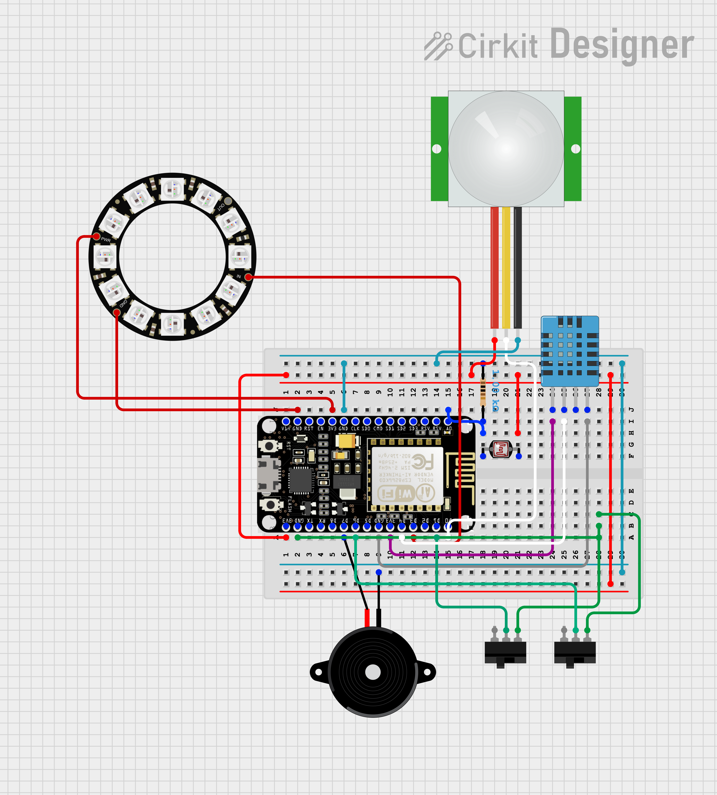

# Smart Lamp With IoT Technology
<!--- Replace this text with a brief description (2-3 sentences) of your project. This description should draw the reader in and make them interested in what you've built. You can include what the biggest challenges, takeaways, and triumphs from completing the project were. As you complete your portfolio, remember your audience is less familiar than you are with all that your project entails! -->
The IoT (internet of things) smart lamp, is a project involving sensors, colorful lights, and wifi. The lamp includes multiple features: changing colors with rgb, detecting the temperature and humidity in a room, automatically turning on and off, sensing motion, and sending alerts to my email and phone. These aspects are not only really convenient, but also easily customizable.

<!--- <You should comment out all portions of your portfolio that you have not completed yet, as well as any instructions:

 This is an HTML comment in Markdown -->
<!--- Anything between these symbols will not render on the published site -->


| **Engineer** | **School** | **Area of Interest** | **Grade** |
|:--:|:--:|:--:|:--:|
| Alicia Y | The Harker School | Mechanical Engineering | Incoming Sophomore 

 
<!---
**Replace the BlueStamp logo below with an image of yourself and your completed project. Follow the guide [here](https://tomcam.github.io/least-github-pages/adding-images-github-pages-site.html) if you need help.**


  
# Final Milestone

**Don't forget to replace the text below with the embedding for your milestone video. Go to Youtube, click Share -> Embed, and copy and paste the code to replace what's below.**

<iframe width="560" height="315" src="https://www.youtube.com/embed/F7M7imOVGug" title="YouTube video player" frameborder="0" allow="accelerometer; autoplay; clipboard-write; encrypted-media; gyroscope; picture-in-picture; web-share" allowfullscreen></iframe>

For your final milestone, explain the outcome of your project. Key details to include are:
- What you've accomplished since your previous milestone
- What your biggest challenges and triumphs were at BSE
- A summary of key topics you learned about
- What you hope to learn in the future after everything you've learned at BSE
-->
# Third Milestone

<iframe width="560" height="315" src="https://www.youtube.com/embed/6E-s-mozakk" title="YouTube video player" frameborder="0" allow="accelerometer; autoplay; clipboard-write; encrypted-media; gyroscope; picture-in-picture; web-share" allowfullscreen></iframe>

My third milestone didn’t actually go according to my original plan. Instead of adding a switch, soldering everything onto a PCB (printed circuit board), and creating the enclosure. This was because the switch is a modification which will be a part of my final milestone, and I want to test my other modifications before soldering all the parts together. Therefore, my third milestone solely revolved around the creation of container.  
My enclosure consists of a clear acrylic box with pieces of light diffusing plastic on the inside. There is also a rectangular cut out for the USB (universal serial bus) cable.  
The main challenge I dealt with was finding a viable solution to house my hardware. Initially, I wanted to use the 3D printer or a laser cutter to create a container; however, I didn’t have access to a laser cutter and the filament the 3D printer uses is completely opaque (the light won’t shine through). Although the solution I came across wasn’t the most optimal, I compromised and worked with what I had. I used a clear acrylic box but made some modifications to it, so it was more my liking. The completely transparent box put the wires and hardware on full display which I didn’t like, so I used light diffusing plastic on the inside in order to block the view of all the wires and to also to distribute the light better. I also needed a rectangular cut out, so one of the instructors helped me cut it out. Although it resulted with some scratches, I didn’t mind too much. The last issue I had was with the LDR (light dependent resistor) sensor. When it is in the box along with the NeoPixel light, it detects the light from the NeoPixel, causing it to turn off the moment it turns on. I resolved the problem by soldering wires to the legs of the LDR sensor so the sensor can peek through the hole my USB cable goes through and detect the outside light while being unaffected by the NeoPixel.  
Currently, my breadboard set up forces the LDR sensor to point downwards and not detect light properly, but after I solder my components onto a PCB, which is lower to the ground, the problem will resolve itself.  
For my modifications, I intend to add a switch and a new light mode. The new light mode, weather mode, will take in weather data and depending on the weather status (sunny, cloudy, rainy) it will change colors. After I test those components, I will solder my parts onto a PCB and complete my project.  


# Second Milestone

<iframe width="560" height="315" src="https://www.youtube.com/embed/1VF3IKby2kg" title="YouTube video player" frameborder="0" allow="accelerometer; autoplay; clipboard-write; encrypted-media; gyroscope; picture-in-picture; web-share" allowfullscreen></iframe>

My second milestone was rather short compared to my first: I coded my neopixel so it would turn on automatically and I fixed some of my code and wiring so my LDR (light dependent resistor) and PIR (passive infrared) sensor ran more smoothly.  
The adjustments I made allowed for my neopixel to turn on when the room is dim or when there is motion, but turn off when it is bright and there is no motion.  
The challenges encountered were the LDR and the PIR sensor, they were my main points in this milestone because it made my project go from inconsistent to smooth. During my first milestone, I wasn’t even aware that the values of my LDR and PIR were inaccurate because I thought the sensors just weren’t that reliable to begin with; however, when my LDR kept outputting single digit values that fluctuated a lot, I knew there was something wrong. The values ranged from 1-14, one should be dark and fourteen should be bright, yet it was going from 3-9 when the lighting in the room didn’t change at all, which meant that something was clearly not working properly. I found out that the positive and negative parts of the sensor were supposed to be connected to the board (this happened a lot, but every single component really had to be connected to the board). Afterwards, the numbers shot up to 400: when I shined my phone flashlight on it it would go up to 600, and when I put it under the table it would go down to 150. These triggers and reactions made a lot more sense and my LDR sensor was completely fine now. My PIR sensor also had the problem where I had to swing my hand in front of it for 15+ seconds before it would read that there is motion. I troubleshooted by isolating it, using code that takes into account low sensitivity, using a different sensor, and twisting the sensitivity knobs (I didn’t even know they existed but they are the two orange knobs). After all the testing, the sensor worked slightly smoother, sometimes it would take longer to detect motion but it works for now.  
The reason why I left my PIR as is is because I plan on using a physical button or switch, so even if the sensor becomes really unreliable, I can still turn the lamp on off and use it with the physical button or switch.  
For my third milestone, I plan on wiring the button or switch to the circuit and adding code for it, soldering everything onto a PCB (printed circuit board), and creating the enclosure.  


# First Milestone

<iframe width="560" height="315" src="https://www.youtube.com/embed/noj1Op3PSlw" title="YouTube video player" frameborder="0" allow="accelerometer; autoplay; clipboard-write; encrypted-media; gyroscope; picture-in-picture; web-share" allowfullscreen></iframe>

My main project is the Smart Lamp with IoT (internet of things) technology. I chose it because of its practicality, design freedom, and multicolor LEDs. When connected to power, the smart lamp’s data appears on a website called Cayenne, which displays information like temperature, motion, and RGB sliders on a dashboard. Cayenne also features triggers that email and text alerts when for example: temperature surpasses a certain threshold.  
For my first milestone I wired all the components together, uploaded the code to the board, and set up Cayenne. I used multiple sensors and components in the project: DHT11 (digital humidity and temperature sensor), PIR sensor (passive infrared sensor → motion), LDR (light dependent resistor → light), 1k resistor, buzzer, neopixel ring light, and NODEMCU esp8266 (board → WiFi connectivity).  
I used a breadboard as the base because it makes troubleshooting very convenient and wired up all the parts. Afterwards, I used the Arduino code in the instructions and attempted to upload it to my NODEMCU. As expected, there were a lot of problems which I will talk about later, but eventually I managed to upload the code and started to troubleshoot a lot of the major errors. After figuring out the code and wiring, I was able to access Cayenne and start creating widgets and triggers.   
Despite everything working by the end of the week, there were a lot of drawbacks throughout the process. I had three major ones, and they each costed me a lot of time and effort to fix. My first problem was uploading the code to my board: it wouldn’t upload no matter what I did. I practically spent an entire day trying different methods: changing the adaptor, cord, arduino settings, and even using a different version of the esp8266 library. None of it worked, except when I changed the library back to the original, an error popped up saying that my board wasn’t the esp8266, but the esp32. I double checked, and turns out my board was the wrong one. After using the write board, I managed to upload the code. The next problem I faced was the DHT11 sensor not receiving proper values, the numbers were always the maximum integer number, zero, or nan (not a number). I decided to isolate the sensor and use sample code to ensure that the sensor was actually working, but it was really frustrating because I would fix the code and the values would seem normal, then five minutes later, without changing anything, it stopped working again. The process of working then not working kept occurring which befuddled and annoyed me because I didn’t understand why it kept happening. I realized two things: the pin mapping of the board was really weird, I had to define pin D2 as either D2 or 4, not just 2; and I had to connect the positive and negative terminals to the pins on the board because that was where there was power. My last problem was my neopixel ring light, it wouldn’t light up or receive values from Cayenne. I used the same tactic: isolation. I found that I had to solder the wires to the light because the connection was very sketchy otherwise, I also altered the code and it lit up. I started troubleshooting the code that wasn’t receiving values and found out that my restrictions for when the light can turn on weren’t allowing it to turn on. I fixed all the problems, and the majority of my project was done.   
I definitely became a lot more efficient at troubleshooting as the later problems were solved in a more timely matter (cough cough my DHT11). For my next milestone, I plan on moving my circuit onto a smaller bread board, finding a reliable power source (maybe I can use a wall outlet), and figuring out how my neopixel can turn on automatically, so I don’t have to manually activate it in Cayenne.   


# Starter Project

<iframe width="560" height="315" src="https://www.youtube.com/embed/l3O3y8DIs7g" title="YouTube video player" frameborder="0" allow="accelerometer; autoplay; clipboard-write; encrypted-media; gyroscope; picture-in-picture; web-share" allowfullscreen></iframe>
 
My starter project is the Useless Box which I chose due to its intriguing concept. I thought: what makes this box useless? Turns out, the Useless Box relies mainly on a motor and a switch. Flipping the switch prompts the motor to rotate an acrylic piece and open the box. However, the acrylic piece eventually hits the switch, flipping it back, causing the motor to reverse and close the box.  
The process to create the project involves soldering a switch, snap switch, LED, resistors, and screw terminals to the circuit board. Then, I screwed two acrylic pieces to the motor, and attached the circuit board to the motor as well. Then I attached the assembly into the base of the box, and connected the batteries. Unfortunately, I didn't progress to the next step, which involves building the acrylic box.  
I wasn’t able to finish the project due to myriad problems I encountered. First, I soldered the snap switch on in the wrong direction. Then, I found out there was an issue with either the circuit lines or the switch, forcing me to restart. The new version included a slightly different snap switch because we ran out of the original. This new snap switch didn’t conduct the electricity properly in my project, which led to the moving acrylic arm not going back down after hitting the switch. I tried solving the problem by taping solder onto the metal flap and gluing the solder onto the metal flap, both of which were unsuccessful. The excess glue also hardened, ruining the switch. I desoldered it and used a new switch, but it still refused to work.  
I already spent a lot of time and still practiced and learned a lot from the useless box so I decided to complete a quick LED starter project. It consists of three sliders that control the RGB (red, green, blue)values and change the color of an LED.  
The difficulties I faced during this experience taught me the importance of patience and problem-solving, qualities that are important when I deal with problems in my intensive project.


# Schematics 
<!-- Here's where you'll put images of your schematics. [Tinkercad](https://www.tinkercad.com/blog/official-guide-to-tinkercad-circuits) and [Fritzing](https://fritzing.org/learning/) are both great resoruces to create professional schematic diagrams, though BSE recommends Tinkercad becuase it can be done easily and for free in the browser.  -->




# Smart Lamp Code
<!--- Here's where you'll put your code. The syntax below places it into a block of code. Follow the guide [here]([url](https://www.markdownguide.org/extended-syntax/)) to learn how to customize it to your project needs. -->

```c++
#include <CayenneMQTTESP8266.h>
#include <ESP8266WiFi.h>
#include <DHT.h>
#include <Adafruit_NeoPixel.h>

#ifdef __AVR__
#include <avr/power.h>
#endif

#define DHTPIN D4
#define DHTTYPE DHT11
#define PIN D3
#define NUMPIXELS 12
#define BUZZER D7

DHT dht(DHTPIN, DHTTYPE);
Adafruit_NeoPixel pixels(NUMPIXELS, PIN, NEO_GRB + NEO_KHZ800);

char ssid[] = "Stratford Guest"; //wifi network you are using
char password[] = ""; //password for wifi network, if it is guest network leave it blank like this
char username[] = "38fe4c00-1446-11ee-9ab8-d511caccfe8c";
char mqtt_password[] = "f4515ae60ab00cf82fda2b96f4744f3112261029";
char client_id[] = "56f30f20-1446-11ee-8485-5b7d3ef089d0";

const int LDRpin = A0;
const int PIRpin = D0;
int LDRval = 0;
int PIRval = 0;
float temp;
float hum;
int r, g, b;
int Cmode;
int TURN;
int SAFE_MODE;


void setup(){
  pinMode(LDRpin, INPUT);
  pinMode(PIRpin, INPUT);
  pinMode(BUZZER, OUTPUT);

  Serial.begin(9600);

  dht.begin();
  Cayenne.begin(username, mqtt_password, client_id, ssid, password);
  pixels.begin();
  Serial.println("FIRE FLY BOOTED");
}

void loop(){
  Cayenne.loop();
  if (Cmode == 1){
    burglarMode();
  }
  else if (Cmode == 0) {
    setLight();
  }

  hum = dht.readHumidity();
  temp = dht.readTemperature();

  Serial.print("humidity = ");
  Serial.println(hum);
  Serial.print("temp = ");
  Serial.println(temp); 

  LDRval = analogRead(LDRpin);
  PIRval = digitalRead(PIRpin);
 
  Cayenne.virtualWrite(0, temp);
  Cayenne.virtualWrite(1, hum);
  Cayenne.virtualWrite(2, LDRval);
  Cayenne.virtualWrite(3, PIRval);

  if (hum > 62 || hum < 40){
    digitalWrite(BUZZER, HIGH);
  }

  if (temp > 29 || temp < 18){
    digitalWrite(BUZZER, HIGH);
  }

  if (SAFE_MODE == 1){
    digitalWrite(BUZZER, LOW);
  }

}

void setColor(int red, int green, int blue){
  for (int i = 0; i < NUMPIXELS; i++){
    if (red == 0 && green == 0 && b == 0){
      red = 100;
      green = 100;
      blue = 100; 
    }
    pixels.setPixelColor(i, pixels.Color(red, green, blue));
    pixels.show();
  }
}

void setLight(){
  if (TURN == 1){
    manual();
  }
  else{
    Serial.println("PIR and LDR");
    Serial.println(PIRval);
    Serial.println(LDRval);

    if (PIRval > 0){
      setColor(r, g, b);
    }
    else if (LDRval < 320){
      setColor(r, g, b);
    }
    else if (PIRval < 1 && LDRval > 320){ 
      for (int i = 0; i < NUMPIXELS; i++){
        pixels.setPixelColor(i, pixels.Color(0, 0, 0));
        pixels.show();
      }
    } 
  }
}

void burglarMode(){
  if (SAFE_MODE == 1){
    digitalWrite(BUZZER, LOW);
  }

  if (PIRval > 0){
    digitalWrite(BUZZER, HIGH);
    Serial.println("burglar on");
  }
}

void manual(){
  setColor(r, g, b);
}

CAYENNE_IN(4){
  r = getValue.asInt();
}

CAYENNE_IN(5){
  g = getValue.asInt();
}

CAYENNE_IN(6){
  b = getValue.asInt();
}

CAYENNE_IN(7){
  Cmode = getValue.asInt(); //Security mode
}

CAYENNE_IN(8){
  TURN = getValue.asInt();
  Serial.print("turn : ");
  Serial.println(TURN);
}

CAYENNE_IN(9){
  SAFE_MODE = getValue.asInt();
}
```

# Bill of Materials
<!-- Here's where you'll list the parts in your project. To add more rows, just copy and paste the example rows below.
Don't forget to place the link of where to buy each component inside the quotation marks in the corresponding row after href =. Follow the guide [here]([url](https://www.markdownguide.org/extended-syntax/)) to learn how to customize this to your project needs. --> 
Incomplete at the moment because project isn't finished this is just what I have so far.

| **Quantity** | **Part** | **Note** | **Price** | **Link** |
|:--:|:--:|:--:|:--:|:--:|
| 1 | NODEMCU ESP8266 | Microcontroller Board with Wifi | $7.99 | <a href="https://www.amazon.com/dp/B010O1G1ES/ref=twister_B086QGXBRW?_encoding=UTF8&psc=1"> Link </a> |
| 1 | DHT11 | Temperature and Humidity Sensor | $9.99 | <a href="https://www.amazon.com/Adafruit-temperature-humidity-sensor-extras-ADA386/dp/B00NAY22V8"> Link </a> |
| 1 | NeoPixel Ring (12 LEDs) | Colorful Light with RGB | $11.40 | <a href="https://www.amazon.com/Adafruit-NeoPixel-Ring-Integrated-Drivers/dp/B00KAE3R1U/ref=sr_1_1crid=B5L3C9ZLNEGO&keywords=adafruit+neopixel+12+led&qid=1689178366&sprefix=adafruit+neopixel+12+led%2Caps%2C151&sr=8-1"> Link </a> |
| 1 | PIR Sensor | Motion Sensor | $11.99 | <a href="https://www.amazon.com/Adafruit-LK-918O-SANV-FBACA-PIR-Motion-Sensor/dp/B00JOZTAC6"> Link </a> |
| 1 | LDR Sensor | Light Sensor | $7.99 | <a href="https://www.amazon.com/BOJACK-Photoresistance-Sensitive-Resistor-GM5539/dp/B07TQMJ212/ref=sr_1_3?crid=30NPCKYPA4HL4&keywords=ldr+sensor&qid=1689181779&sprefix=ldr+sensor+adafruit%2Caps%2C184&sr=8-3"> Link </a> |
| 1 | Buzzer | Sends High Low Signals | $6.98 | <a href="https://www.amazon.com/Cylewet-Electronic-Magnetic-Continuous-Arduino/dp/B01N7NHSY6/ref=sr_1_3?crid=WN57I7A8ZBMC&keywords=buzzer+electronics&qid=1689180534&sprefix=buzzer+elec%2Caps%2C150&sr=8-3"> Link </a> |
| 1 | 1K Resistor | Slows Down the Electrical Current | $5.99 | <a href="https://www.amazon.com/EDGELEC-Resistor-Tolerance-Multiple-Resistance/dp/B07QG1V4YL/ref=sr_1_4?crid=3EFHJNWIP3LWT&keywords=1k+resistor&qid=1689180561&sprefix=1k+resistor%2Caps%2C193&sr=8-4"> Link </a> |
| 10-15 | Male to Male Wires | Wiring Components | $9.99 | <a href="https://www.amazon.com/Elegoo-EL-CP-004-Multicolored-Breadboard-arduino/dp/B01EV70C78/ref=sr_1_4?crid=2E8KWUHA2SB4V&keywords=male%2Bto%2Bmale%2Bwires&qid=1689182362&sprefix=male%2Bto%2Bmale%2Bwires%2Caps%2C172&sr=8-4&th=1"> Link </a> |
| 3 | Female to Male Wires | Wiring Components | $9.99 | <a href="https://www.amazon.com/Elegoo-EL-CP-004-Multicolored-Breadboard-arduino/dp/B01EV70C78/ref=sr_1_4?crid=2E8KWUHA2SB4V&keywords=male%2Bto%2Bmale%2Bwires&qid=1689182362&sprefix=male%2Bto%2Bmale%2Bwires%2Caps%2C172&sr=8-4&th=1"> Link </a> (same link as above)|
| 1 | Breadboard | Prototyping and Base for Circuit | $12.99 | <a href="https://www.amazon.com/EL-CP-003-Breadboard-Solderless-Distribution-Connecting/dp/B01EV6LJ7G/ref=sr_1_4crid=2JO3WCBVW2ZO5&keywords=breadboard&qid=1689182601&sprefix=breadboar%2Caps%2C152&sr=8-4&th=1"> Link </a> |
| 1 | Clear Acrylic Box | Enclosure | $16.99 | <a href="https://www.amazon.com/Hewomate-Acrylic-Display-3-9x3-9x3-9-Containers/dp/B09YVLXYC8/ref=sr_1_2crid=1KZVRMN2WVN3I&keywords=acrylic+box+3.9+x+3.9+x3.9+in&qid=1689809468&sprefix=acrylic+box+3.9+x+3.9+x3.9+in%2Caps%2C144&sr=8-2"> Link </a> |
| 2 | Stencil Making Sheet | Diffusing Light | $13.99 | <a href="https://www.amazon.com/Translucent-Stencil-Gyro-Cut-Template-Material/dp/B08PVYHH4M/ref=sr_1_5crid=2WLCSK4EWCFYZ&keywords=banltre+10+sheets+10+mil+mylar+sheet&qid=1689809595&sprefix=banltre+%2Caps%2C132&sr=8-5"> Link </a> |


<!--
# Other Resources/Examples
One of the best parts about Github is that you can view how other people set up their own work. Here are some past BSE portfolios that are awesome examples. You can view how they set up their portfolio, and you can view their index.md files to understand how they implemented different portfolio components.
- [Example 1](https://trashytuber.github.io/YimingJiaBlueStamp/)
- [Example 2](https://sviatil0.github.io/Sviatoslav_BSE/)
- [Example 3](https://arneshkumar.github.io/arneshbluestamp/)

To watch the BSE tutorial on how to create a portfolio, click here. -->
